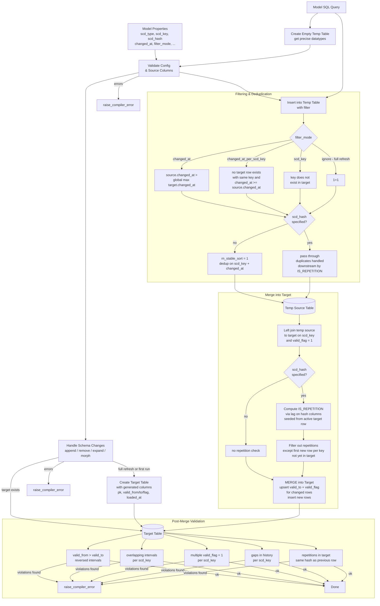

# DVH Makroer
Makroene er inndelt i mapper etter bruksområde.
## `scd`
Implementasjon av DBT materialiseringstype `scd` som støtter Slowly Changing Dimension Type 0, 1, og 2 inkrementelle SQL transformasjoner/modeller for dbt-oracle adapteret.

Dette løses hovedsaklig ved å sortere innkommende rader, slå opp mot eksisterende tabell, og så eksekvere MERGE på Primary Key kolonne.

Navngivning og metadata kolonner følger typisk DVH bruk.


| SCD    | Action          |
|--------|-----------------|
| Type 0 | Retain original |
| Type 1 | Overwrite       |
| Type 2 | Add new row     |

Ytterligere informasjon:
- [Wikipedia](https://en.wikipedia.org/wiki/Slowly_changing_dimension) for en grei introduksjon.
- [Data Warehouse Toolkit](https://www.oreilly.com/library/view/the-data-warehouse/9781118530801/) bok av Ralph Kimball

### Eksempel modell
```yaml
models:
    - name: dim_kodeverk
      description: SCD-1 dimensjon for grønnsaker
      config:
        materialized: scd
        scd_type: 1
        scd_key: kode
        scd_hash: [navn, kildesystem]
        filter_mode: changed_at
```
### Materialisering Flowchart

## `utils` (under arbeid)